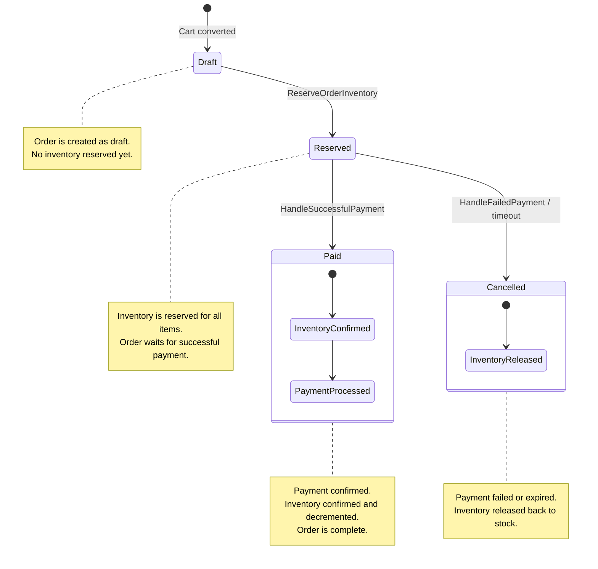

<p align="center">
  
</p>

# Yuki Headless E-commerce Backoffice

**Laravel 12 · Inertia.js · React**

Yuki is a **headless, backend-driven e-commerce backoffice** designed as a **domain-first, extensible e-commerce engine**.

It focuses on **business correctness, data consistency, and long-term maintainability**, rather than quick shortcuts or tightly coupled frontend logic.

The storefront (B2C) is intentionally **decoupled** and can be implemented using any technology (Next.js, Nuxt, mobile apps, etc.) consuming the exposed APIs.

---

## Project Goals

-   Headless, API-first architecture
-   Backend-driven business rules
-   Clear domain boundaries
-   Reusable across multiple e-commerce projects
-   Long-term maintainability
-   Admin panel built with Inertia + React
-   Frontend-agnostic storefronts
-   Payment provider agnostic architecture

---

## Tech Stack

### Backend

-   **Laravel 12**
-   MySQL / PostgreSQL
-   REST API (GraphQL-ready)

### Admin Panel

-   **Inertia.js**
-   **React**
-   Tailwind CSS

### Authentication

-   Laravel Breeze (admin only)

---

## Architecture Overview

Yuki follows a **domain-oriented architecture**.

Business rules live in the backend and are never delegated to external systems or the frontend.

```
Backend (Laravel)
├── Domains
│ ├── Catalog
│ ├── Pricing
│ ├── Inventory
│ ├── Cart
│ ├── Orders
│ ├── Payments
│ │ ├── Actions
│ │ ├── Contracts
│ │ ├── DTOs
│ │ ├── Models
│ │ ├── Resolvers
│ │ └── Stripe / PayPal
│ ├──Pricing
│ └── Storefront
├── Http
│ ├── Controllers
│ │ ├── Admin
│ │ ├── Storefront
│ │ └── Webhooks
│ └── Requests
└── ...
```

### Key principles

-   **Domains** contain business logic
-   **Actions** encapsulate use cases
-   **Controllers** are thin and orchestration-only
-   **Storefront** consumes APIs only
-   **External services never touch domain logic**

---

## Core Concepts

### Products & Variants

-   `Product` represents a conceptual item (e.g. _T-Shirt_)
-   `ProductVariant` represents a sellable unit (e.g. _Black / M_)
-   Every product **must have at least one variant**
-   Variants are the single source of truth for:
    -   Pricing
    -   Inventory
    -   SKU

---

### Pricing

-   Prices are stored in **minor units** (e.g. cents)
-   Multi-currency supported
-   Multiple prices per variant
-   Validity ranges and VAT rates supported
-   Pricing is **time-aware** and **currency-aware**

---

### Inventory

Inventory is strictly controlled and never modified implicitly.

Each variant has:

-   `quantity` → total stock
-   `reserved` → temporarily locked stock
-   `backorder_allowed`

#### Inventory Actions

-   `ReserveInventory`
-   `ReleaseInventory`
-   `ReserveOrderInventory`
-   `ConfirmOrderInventory`
-   `ReleaseOrderInventory`

All inventory actions are:

-   **Transactional**
-   **Idempotent**
-   **Order-aware**

---

## Cart

-   The cart is a first-class domain entity
-   Identified via a **token**
-   Fully stateless on the frontend
-   All mutations are validated server-side

Supported operations:

-   Add item
-   Update quantity
-   Remove item
-   Read cart with totals

---

## Orders & OrderItems

-   `Order` represents a purchase intent
-   `OrderItem` stores a **snapshot** of the variant at purchase time:
    -   SKU
    -   Name
    -   Attributes
    -   Unit price
    -   Quantity
    -   Totals

This guarantees **historical consistency**, even if catalog data changes later.

---

## Order Lifecycle

Orders follow a **strict and explicit lifecycle**.

```
draft → reserved → paid
```

### Transitions

-   **draft → reserved**

    -   Triggered by `CreateOrderFromCart`
    -   Inventory is reserved but not consumed

-   **reserved → paid**

    -   Triggered by `HandleSuccessfulPayment`
    -   Inventory is confirmed and decremented

-   **reserved → cancelled**
    -   Triggered by `HandleFailedPayment` or timeout
    -   Inventory is released

There are **no implicit transitions**.

---

## Payment Architecture

Payments are **provider-agnostic at domain level**.

External gateways are handled at infrastructure level and mapped to domain actions.

```
Payment Provider (Stripe / PayPal)
↓
Webhook / API Controller
↓
PaymentProviderResolver
↓
PaymentProvider interface
↓
PaymentWebhookData (DTO)
↓
HandleSuccessfulPayment | HandleFailedPayment
↓
Order + Inventory actions
```

---

### Order & Payment State Machine



### How it works:

-   **Draft → Reserved:** Triggered by `CreateOrderFromCart` and `ReserveOrderInventory`. Stock is only reserved.
-   **Reserved → Paid:** Triggered by `HandleSuccessfulPayment`. Payment confirmed, inventory decremented.
-   **Reserved → Cancelled:** Triggered by `HandleFailedPayment` or timeout. Stock released, order cancelled.

---

## Admin Panel

-   Manage products, variants, prices, currencies
-   Handle inventory and backorders
-   View/manage orders
-   Enable/disable payment providers via UI

Built with **Inertia + React**, tightly integrated with backend domains.

---

## API Layer

-   Exposes normalized, validated data
-   Multi-currency pricing and inventory support
-   Independent from admin panel

---

## Current Status

✅ Project bootstrapped  
✅ Admin authentication  
✅ Catalog & pricing domains  
✅ Inventory reservation & release  
✅ Cart domain  
✅ Order lifecycle & state machine  
✅ Payment provider abstraction  
✅ Stripe integration  
✅ Admin payment provider management

🚧 In progress:

-   PayPal integration
-   Shipping & fulfillment
-   Discounts & promotions
-   Event-driven notifications
-   Storefront API expansion
-   Automated tests

---

## Installation

```bash
git clone <repository-url>
cd project-name

composer install
npm install

cp .env.example .env
php artisan key:generate

php artisan migrate
npm run dev
php artisan serve
```

## Contributing (Open-Source)

Contributions from developers of all levels are welcome!

**Guidelines**

1. Fork the repo and create a feature branch:

```
git checkout -b feature/my-feature
```

2. Commit changes with clear messages:

```
git commit -m "Add new feature / fix bug / update docs"
```

3. Push and open a pull request

**Code Style and Best Practices:**

-   Follow Laravel conventions
-   Keep controllers thin, logic in Actions
-   Place business logic in domain Actions
-   Avoid provider-specific logic in domains
-   Prefer explicit state transitions
-   Ensure idempotency for inventory and payments
-   Write readable, intention-revealing code

**Areas of Contribution:**

-   Storefront API endpoints
-   Payment providers
-   Shipping modules
-   Discounts & promotions
-   Admin UI improvements
-   Test and documentation

**Discussions, issues, and PRs** are encourage - no idea is too small!

## Philosophy

Yuki is **not** a ready-made shop.

It is a foundation:

-   opinionated where needed
-   flexible where it matters
-   designed for developers building real-world e-commerce systems

---

## License

This project is open-source and licensed under the MIT license.
