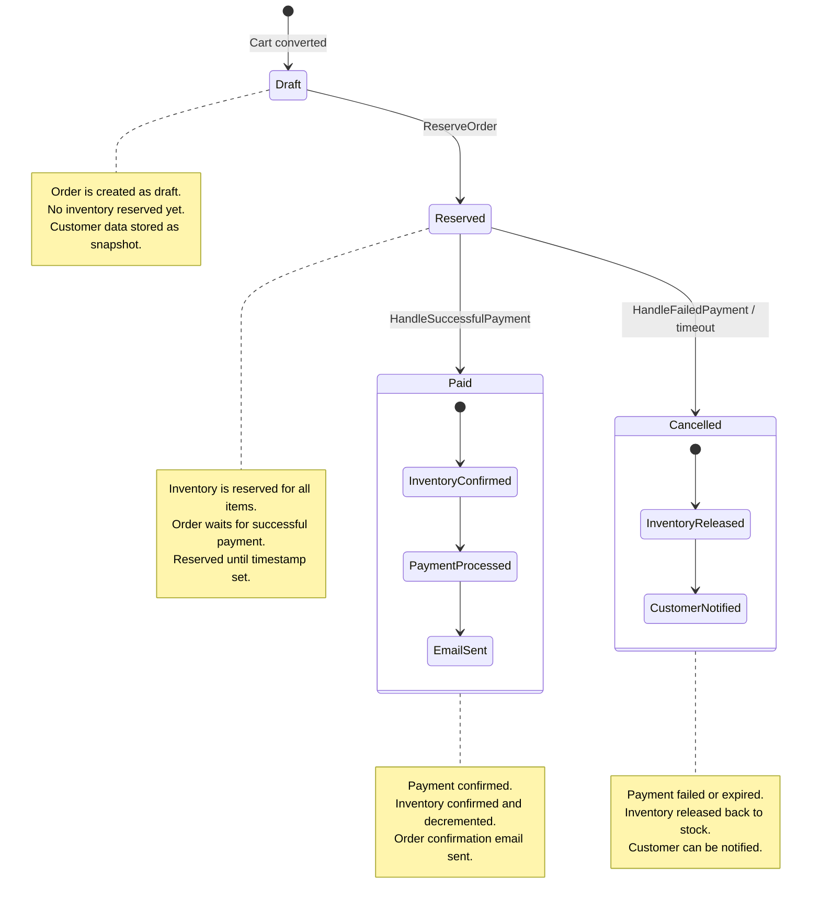

<p align="center">
  
</p>

# Yuki Headless E-commerce Backoffice

**Laravel 12 · Inertia.js · React**

Yuki is a **headless, backend-driven e-commerce backoffice** designed as a **domain-first, extensible e-commerce engine**.

It focuses on **business correctness, data consistency, and long-term maintainability**, rather than quick shortcuts or tightly coupled frontend logic.

The storefront (B2C) is intentionally **decoupled** and can be implemented using any technology (Next.js, Nuxt, mobile apps, etc.) consuming the exposed APIs.

---

## Project Goals

-   Headless, API-first architecture
-   Backend-driven business rules
-   Clear domain boundaries
-   Reusable across multiple e-commerce projects
-   Long-term maintainability
-   Admin panel built with Inertia + React
-   Frontend-agnostic storefronts
-   Payment provider agnostic architecture
-   Guest and authenticated checkout support
-   Event-driven architecture for extensibility

---

## Tech Stack

### Backend

-   **Laravel 12**
-   MySQL / PostgreSQL
-   REST API (GraphQL-ready)
-   Event-driven architecture

### Admin Panel

-   **Inertia.js**
-   **React**
-   Tailwind CSS

### Authentication

-   Laravel Breeze (admin panel)
-   Separate storefront authentication (customer-facing)

---

## Architecture Overview

Yuki follows a **domain-oriented architecture**.

Business rules live in the backend and are never delegated to external systems or the frontend.

```
Backend (Laravel)
├── Domains
│   ├── Catalog
│   ├── Pricing
│   ├── Inventory
│   ├── Cart
│   ├── Customer               ← NEW
│   │   ├── Models
│   │   │   ├── StorefrontUser
│   │   │   ├── CustomerProfile
│   │   │   └── Address
│   │   └── Actions
│   ├── Orders
│   │   ├── Events             ← NEW
│   │   └── Actions
│   ├── Payments
│   │   ├── Events             ← NEW
│   │   ├── Actions
│   │   ├── Contracts
│   │   ├── DTOs
│   │   ├── Models
│   │   ├── Resolvers
│   │   └── Stripe / PayPal
│   ├── Pricing
│   └── Storefront
│       ├── DTOs
│       │   └── Checkout       ← NEW
│       ├── Queries
│       └── Transformers
├── Http
│   ├── Controllers
│   │   ├── Admin
│   │   ├── Storefront
│   │   │   ├── Cart
│   │   │   ├── Catalog
│   │   │   └── Checkout
│   │   └── Webhooks
│   ├── Middleware
│   │   └── EnsureCartToken    ← NEW
│   └── Requests
├── Listeners                    ← NEW
│   └── Order
│       └── SendOrderConfirmationEmail
└── Console
    └── Commands
        └── ExpireReservedOrdersCommand  ← NEW
```

### Key principles

-   **Domains** contain business logic
-   **Actions** encapsulate use cases
-   **Controllers** are thin and orchestration-only
-   **Storefront** consumes APIs only
-   **External services never touch domain logic**

---

## Core Concepts

### Products & Variants

-   `Product` represents a conceptual item (e.g. _T-Shirt_)
-   `ProductVariant` represents a sellable unit (e.g. _Black / M_)
-   Every product **must have at least one variant**
-   Variants are the single source of truth for:
    -   Pricing
    -   Inventory
    -   SKU

---

### Pricing

-   Prices are stored in **minor units** (e.g. cents)
-   Multi-currency supported
-   Multiple prices per variant
-   Validity ranges and VAT rates supported
-   Pricing is **time-aware** and **currency-aware**
-   Polymorphic relationships allow pricing for any entity

---

### Inventory

Inventory is strictly controlled and never modified implicitly.

Each variant has:

-   `quantity` → total stock
-   `reserved` → temporarily locked stock
-   `available` → computed accessor (quantity - reserved)

#### Inventory Actions

-   `ReserveInventory` - Reserve stock for a variant
-   `ReleaseInventory` - Release reserved stock
-   `ReserveOrderInventory` - Reserve stock for all items in an order
-   `ConfirmOrderInventory` - Confirm reservation and decrement stock
-   `ReleaseOrderInventory` - Release all reserved stock for an order

All inventory actions are:

-   **Transactional**
-   **Idempotent**
-   **Order-aware**
-   **Support backorders when enabled**

### Customer System

#### Authentication & Profiles

Yuki separates admin authentication from storefront authentication:

-   Admin users → `users` table (Laravel Breeze)
-   Storefront users → `storefront_users` table (custom)

#### Customer Profiles

-   CustomerProfile → stores customer information
-   Can be linked to a `StorefrontUser` (registered) or standalone (guest)
-   Contains: email, name, phone, marketing preferences
-   Related to multiple addresses

#### Addresses

-   Address → shipping and billing addresses
-   Linked to `CustomerProfile`
-   Support for multiple addresses per type
-   Default address flagging
-   Converted to **immutable snapshot** when orders are created

#### Guest vs Registered Checkout

**Guest Checkout**

```
User → Cart → Checkout (provide email + addresses) → Order created
```

-   No account required
-   `guest_checkout = true`
-   `customer_profile_id = null`
-   Can convert to registered later

**Registered Checkout**

```
User → Register → Profile + Addresses → Cart → Checkout → Order created
```

-   Reuse saved addresses
-   Order history tracking
-   `guest_checkout = false`
-   `customer_profile_id` linked

---

## Cart

-   The cart is a first-class domain entity
-   Identified via a **token** (UUID)
-   Fully stateless on the frontend
-   All mutations are validated server-side
-   Protected by `EnsureCartToken` middleware

Supported operations:

-   Crate cart
-   Add item (with price snapshot)
-   Update quantity
-   Remove item
-   Read cart with totals

---

## Orders & OrderItems

-   `Order` represents a purchase intent
-   `OrderItem` stores a **snapshot** of the variant at purchase time:
    -   SKU
    -   Name
    -   Attributes
    -   Unit price
    -   Quantity
    -   Totals

### Order Customer Data (Immutable Snapshot)

-   `customer_email`
-   `customer_full_name`
-   `customer_phone`
-   `shipping_address` (JSON)
-   `billing_address` (JSON)
-   `customer_profile_id` (optional link)
-   `guest_checkout` (boolean flag)

This guarantees **historical consistency**, even if customers update their profile or addresses, orders preserve the original data.

---

## Order Lifecycle

Orders follow a **strict and explicit lifecycle**.

```
draft → reserved → paid
        ↓
    cancelled
```

### Transitions

-   **draft → reserved**

    -   Triggered by `ReserveOrder`
    -   Inventory is reserved but not consumed
    -   `reserved_until` timestamp set (default: 15 minutes)
    -   Dispatches `OrderReserved` event

-   **reserved → paid**

    -   Triggered by `HandleSuccessfulPayment`
    -   Inventory is confirmed and decremented
    -   Dispatches `OrderPaid` event
    -   Sends order confirmation email

-   **reserved → cancelled**
    -   Triggered by `HandleFailedPayment` or reservation timeout
    -   Inventory is released back to available stock
    -   Dispatches `OrderCancelled` event

There are **no implicit transitions**.

### Automatic Order Expiration

Orders with expired reservations are automatically cancelled:

```bash
# Scheduled every 5 minutes
php artisan orders:expire-reservations
```

---

## Event-Driven Architecture

Yuki uses Laravel events for extensibility and decoupling:

### Order Events

-   `OrderCreated` - Order created from cart
-   `OrderReserved` - Inventory reserved
-   `OrderPaid` - Payment confirmed
-   `OrderCancelled` - Order cancelled
-   `OrderReservationExpired` - Reservation timeout

### Payment Events

-   `PaymentCreated` - Payment initialized
-   `PaymentSuccessful` - Payment confirmed
-   `PaymentFailed` - Payment failed

### Event Listeners

-   `SendOrderConfirmationEmail` - Sends email on OrderPaid
-   Easily add more: analytics, notifications, integrations

---

## Payment Architecture

Payments are **provider-agnostic at domain level**.

External gateways are handled at infrastructure level and mapped to domain actions.

```
Payment Provider (Stripe / PayPal)
↓
Webhook / API Controller
↓
PaymentProviderResolver
↓
PaymentProvider interface
↓
PaymentWebhookData (DTO)
↓
HandleSuccessfulPayment | HandleFailedPayment
↓
Order + Inventory actions + Events
```

### Supported Providers

-   ✅ Stripe (fully integrated)
-   ✅ PayPal (fully integrated)
-   Easy to add more via `PaymentProvider` interface

---

### Order & Payment State Machine



---

## Admin Panel

-   Menage products, variants, prices, currency
-   Handle inventory and backorders
-   View/manage orders with customer details
-   View customer profiles and order history
-   Enable/disable payment providers via UI
-   Monitor inventory reservations

Built with **Inertia+React**, tightly integrated with backends domains.

---

## Api Layer

###Storefront API (v1)
**Public Endpoints**

```
GET  /api/storefront/v1/products          - List products
GET  /api/storefront/v1/products/{slug}   - Product detail
POST /api/storefront/v1/carts             - Create cart
```

**Protected Endpoints** (require `X-Cart-Token` header)

```
GET    /api/storefront/v1/cart              - Get cart
POST   /api/storefront/v1/cart/items        - Add item
PATCH  /api/storefront/v1/cart/items/{id}   - Update quantity
DELETE /api/storefront/v1/cart/items/{id}   - Remove item
POST   /api/storefront/v1/checkout          - Checkout
```

**Webhook Endpoints**

```
POST /api/webhooks/payments/{provider}  - Payment webhooks
```

### API Features

-   Multi-currency pricing support
-   Inventory availability checks
-   Guest and authenticated checkout
-   Address snapshot preservation
-   Comprehensive error handling

---

## Current Status

✅ Completed:

-   Project bootstrapped
-   Admin authentication (Breeze)
-   Catalog & pricing domains
-   Inventory reservation & release system
-   Cart domain w/ token-based access
-   Order lifecycle & state machine
-   Customer authentication system
-   Guest and registered checkout
-   Address management
-   Order immutability (snapshots)
-   Payment provider abstraction
-   Stripe integration
-   PayPal integration
-   Admin payment provider management
-   Event-driven architecture
-   Automated order expiration
-   Email notifications
-   Comprehensive test suite (Pest)

🚧 In progress:

-   Shipping & fulfillment domain
-   Discounts & promotions system
-   Advanced admin UI features
-   API documentation (OpenAPI/Swagger)

🎯 Planned:

-   Multi-warehouse inventory
-   Product reviews & ratings
-   Advanced analytics & reporting
-   Multi-language support
-   GraphQL Api

---

## Installation

```bash
# Clone repository
git clone <repository-url>
cd yuki_headless_ecommerce

# Install dependencies
composer install
npm install

# Environment setup
cp .env.example .env
php artisan key:generate

# Database setup
php artisan migrate
php artisan db:seed

# Queue setup (for events)
php artisan queue:table
php artisan migrate

# Compile assets
npm run dev

# Start servers
php artisan serve

# In another terminal: start queue worker
php artisan queue:work
```

### Configuration

Update `.env` with your settings:

```env
# Database
DB_CONNECTION=mysql
DB_DATABASE=yuki

# Orders
ORDER_RESERVATION_TIMEOUT=15
ORDER_NUMBER_PREFIX=ORD

# Payment Providers
STRIPE_KEY=your_key
STRIPE_SECRET=your_secret
STRIPE_WEBHOOK_SECRET=your_webhook_secret

PAYPAL_MODE=sandbox
PAYPAL_CLIENT_ID=your_client_id
PAYPAL_SECRET=your_secret

# Mail (for notifications)
MAIL_MAILER=smtp
MAIL_FROM_ADDRESS="noreply@yourstore.com"

# Queue
QUEUE_CONNECTION=database
```

### Scheduled Tasks

Add to your crontab:

```bash
* * * * * cd /path-to-yuki && php artisan schedule:run >> /dev/null 2>&1
```

This runs the order expiration check every 5 minutes.

---

## Testing

```bash
# Run all tests
php artisan test

# Run specific test
php artisan test --filter CheckoutFlowTest

# Run with coverage
php artisan test --coverage
```

### Test Coverage

-   Cart operations (create, add, update, remove)
-   Guest checkout flow
-   Registered user checkout flow
-   Inventory reservation
-   Cart token validation
-   Address snapshots in orders

---

## Contributing (Open-Source)

Contributions from developers of all levels are welcome!

**Guidelines**

1. Fork the repo and create a feature branch:

```bash
git checkout -b feature/my-feature
```

2. Follow conventions

-   Laravel best practices
-   Keep controllers thin
-   Business logic in Actions
-   Never put domain logic in controllers
-   Write test for new features

3. Commit with clear messages:

```bash
git commit -m "feat(domain): add feature description"
```

4. Open a pull request

**Code Style and Best Practices:**

-   Follow Laravel conventions
-   Use type hints and return types
-   Keep methods focused and single-purpose
-   Prefer explicit over implicit
-   Write self-documenting code
-   Add PHPDoc for complex logic

**Areas of Contribution:**

-   Domains: Shipping, Discounts, Reviews
-   Payment providers: Add new integrations
-   Admin UI: Enhance management features
-   API: New endpoints, GraphQL
-   Testing: Increase coverage
-   Documentation: Guides, examples, API docs
-   Performance: Optimization, caching

**Discussions, issues, and PRs** are encourage - no idea is too small!

---

## Philosophy

Yuki is **not** a ready-made shop.

It is a foundation:

-   Opinionated where it matters (architecture, domain boundaries)
-   Flexible where it counts (payment providers, frontend, deployment)
-   Designed for developers building real-world e-commerce systems
-   Focused on long-term maintainability over quick wins

### Design Principles

1. **Domain-First**: Business logic lives in domains, not controllers
2. **Immutability**: Orders preserve snapshots, never rely on mutable data
3. **Explicitness**: No magic, no implicit behaviors
4. **Testability**: Every action and domain is independently testable
5. **Extensibility**: Events and interfaces enable customization
6. **Separation of Concerns**: Clear boundaries between domains

---

## Documentation

-   Architecture Decision Records - Coming Soon
-   API Documentation - Coming Soon
-   Domain Guide - Coming Soon
-   Deployment Guide - Coming Soon

---

## License

This project is open-source and licensed under the MIT license.

---

## Credits

Built w/ 🈯 By Yuki's dad

Contribution from the community are what make open source amazing. Tank You to everyone who wants to contributes!

---

## Support

-   📖 Documentation - Coming Soon
-   💬 <a href='https://github.com/imperfectcircle/yuki_headless_ecommerce/discussions'>Discussions</a>
-   🐛 <a href='https://github.com/imperfectcircle/yuki_headless_ecommerce/issues'>Issues</a>
-   ⭐ Star the repo if you find it useful!
