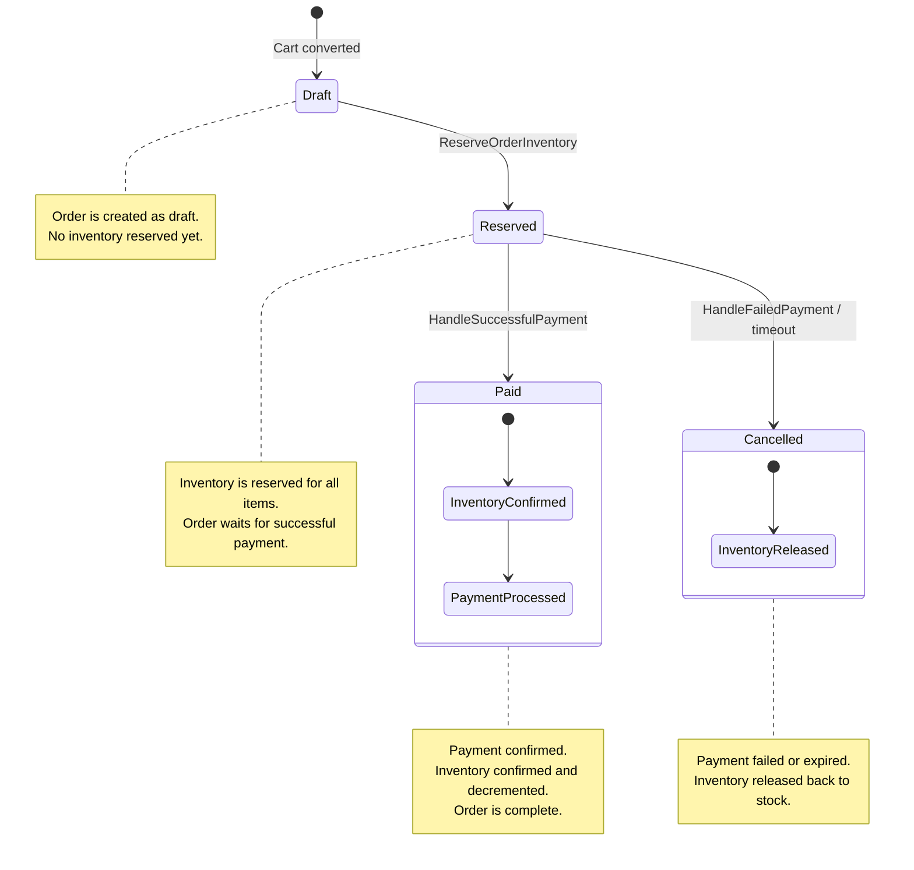

<p align="center">
    
</p>

# Yuki Headless E-commerce Backoffice

**Laravel 12 + Inertia.js + React**

Yuki is a **headless, backend-driven e-commerce backoffice** built with **Laravel**, **Inertia.js**, and **React**.

It is designed as a **scalable, domain-first e-commerce engine**, capable of powering multiple storefronts while keeping **business logic, consistency, and maintainability** at the core.

The storefront (B2C) is intentionally **decoupled** and can be implemented using any technology (Next.js, Nuxt, mobile apps, etc.), consuming the exposed APIs.

---

## Project Goals

-   Headless, API-first architecture
-   Backend-driven business rules
-   Clear domain separation
-   Reusable across multiple e-commerce projects
-   Long-term maintainability
-   Admin panel built with Inertia + React
-   Frontend-agnostic storefronts

---

## Tech Stack

### Backend

-   **Laravel 12**
-   MySQL / PostgreSQL
-   REST API (GraphQL-ready)

### Admin Panel

-   **Inertia.js**
-   **React**
-   Tailwind CSS

### Authentication

-   Laravel Breeze (admin only)

---

## Architecture Overview

-   **Domains**: contain business rules and domain logic
-   **Actions**: encapsulate business use cases
-   **Controllers**: thin, delegate to domain actions
-   **Storefront**: external, consumes APIs

```
Backend (Laravel)
├── Domains
│ ├── Catalog
│ ├── Pricing
│ ├── Inventory
│ ├── Orders
│ ├── Payments
│ └── ...
├── Http
│ ├── Controllers
│ │ ├── Admin
│ │ ├── Api
│ │ └── Webhooks
│ └── Requests
└── ...
```

## Core Concepts

### Products & Variants

-   `Product`: conceptual item (e.g., _T-Shirt_)
-   `ProductVariant`: sellable unit (e.g., _Black / M_)
-   Every product must have **at least one variant**
-   Variants are the single source of truth for pricing, inventory, and SKU

### Pricing

-   Stored in **minor units** (e.g., cents)
-   Multi-currency supported via `Currency`
-   Multiple prices per variant, with validity ranges and VAT

### Inventory

-   Tracks `quantity`, `reserved`, and `backorder_allowed`
-   Actions:
    -   `ReserveInventory`, `ReleaseInventory`
    -   `ReserveOrderInventory`, `ConfirmOrderInventory`, `ReleaseOrderInventory`
-   All actions are **transactional and idempotent**

---

## Orders & OrderItems

-   `Order` captures the purchase
-   `OrderItem` stores **snapshot** of product variant at purchase:
    -   SKU, Name, Attributes, Unit price, Quantity, Totals
-   Orders maintain **historical consistency**

---

## Order Lifecycle

```
draft → reserved → paid
```

-   `draft → reserved`: inventory reserved
-   `reserved → paid`: successful payment, inventory confirmed
-   `reserved → cancelled`: payment failed, inventory released

No implicit transitions.

---

## Payment Architecture

-   **Provider-agnostic domain**
-   Handles Stripe, PayPal, or future gateways at infrastructure level
-   Webhooks map to domain actions (`HandleSuccessfulPayment` / `HandleFailedPayment`)
-   Idempotent and transactional

```
Payment Provider (Stripe / PayPal)
↓
PaymentWebhookController
↓
PaymentProvider interface
↓
PaymentWebhookData (DTO)
↓
HandleSuccessfulPayment | HandleFailedPayment
↓
Order + Inventory domain actions
```

---

### Order & Payment State Machine



### How it works:

-   **Draft → Reserved:** Triggered by `CreateOrderFromCart` and `ReserveOrderInventory`. Stock is only reserved.
-   **Reserved → Paid:** Triggered by `HandleSuccessfulPayment`. Payment confirmed, inventory decremented.
-   **Reserved → Cancelled:** Triggered by `HandleFailedPayment` or timeout. Stock released, order cancelled.

---

## Admin Panel

-   Manage products, variants, prices, currencies
-   Handle inventory and backorders
-   View/manage orders
-   Enable/disable payment providers via UI

Built with **Inertia + React**, tightly integrated with backend domains.

---

## API Layer

-   Exposes normalized, validated data
-   Multi-currency pricing and inventory support
-   Independent from admin panel

---

## Current Status

✅ Project bootstrapped  
✅ Authentication (admin)  
✅ Catalog & pricing domains  
✅ Inventory actions  
✅ Order lifecycle state machine  
✅ Payment provider abstraction & webhook handling

🚧 In progress:

-   Shipping & fulfillment
-   Discounts & promotions
-   Event-driven notifications
-   Storefront integrations

---

## Installation

```bash
git clone <repository-url>
cd project-name

composer install
npm install

cp .env.example .env
php artisan key:generate

php artisan migrate
npm run dev
php artisan serve
```

## Contributing (Open-Source)

Contributions from developers of all levels are welcome!

**Guidelines**

1. Fork the repo and create a feature branch:

```
git checkout -b feature/my-feature
```

2. Commit changes with clear messages:

```
git commit -m "Add new feature / fix bug / update docs"
```

3. Push and open a pull request

**Code Style and Best Practices:**

-   Follow Laravel conventions
-   Keep controllers thin, logic in Actions
-   Write Domain-pure, testable code
-   All inventory/payment operations must be idempotent

**Areas of Contribution:**

-   Storefront API endpoints
-   Shipping & fulfillment modules
-   Discount & promotions
-   UI enanchement for admin
-   Additional payment provider integrations
-   Test and documentation improvements

**Discussions, issues, and PRs** are encourage - no idea is too small!

## Philosophy

Yuki is **not** a ready-made shop.

It is a foundation:

-   opinionated where needed
-   flexible where it matters
-   designed for developers building real-world e-commerce systems

---

## License

This project is open-source and licensed under the MIT license.
